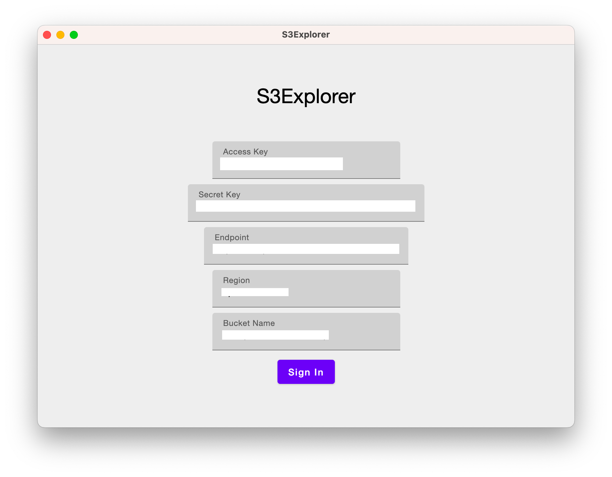
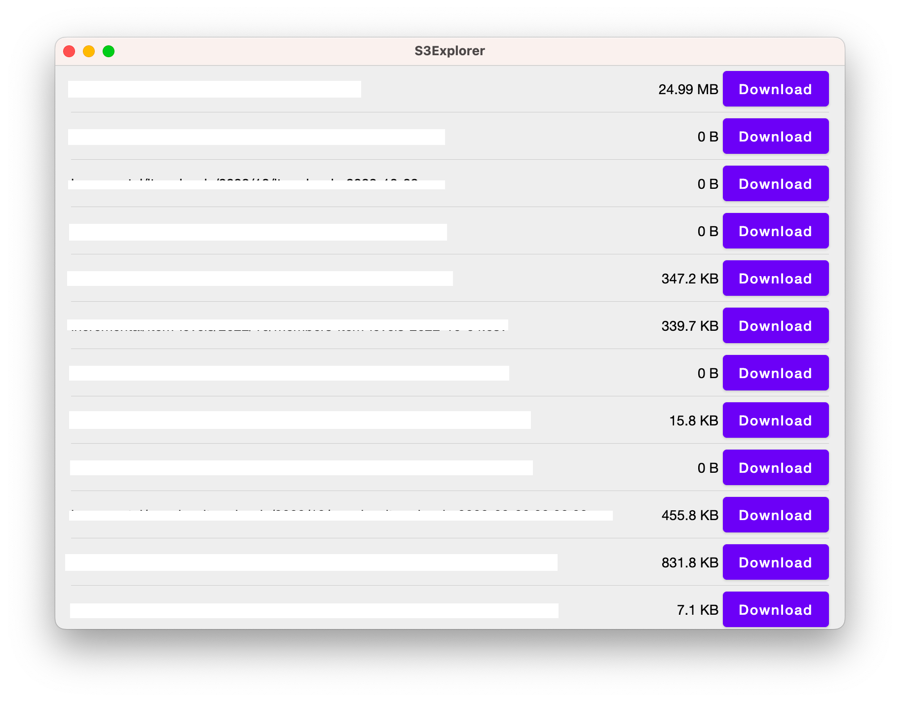

# S3E

S3 compatible storage

## Features

- [x] Authentication
    - [x] Access token based
- [ ] File
    - [x] File download
    - [ ] File delete
    - [ ] File upload

## Supported Platform

- [ ] Desktop
  - [x] Windows
  - [x] MacOS
- [ ] Mobile
  - [ ] Android
  - [ ] iOS

## Rationale

We used S3 compatible storage service a lot in my work, however we only have a tools which are not easy to be used by a
non-tech guy. And there is not a single free client exist which match our needs.

## License

Licensed under MIT License
